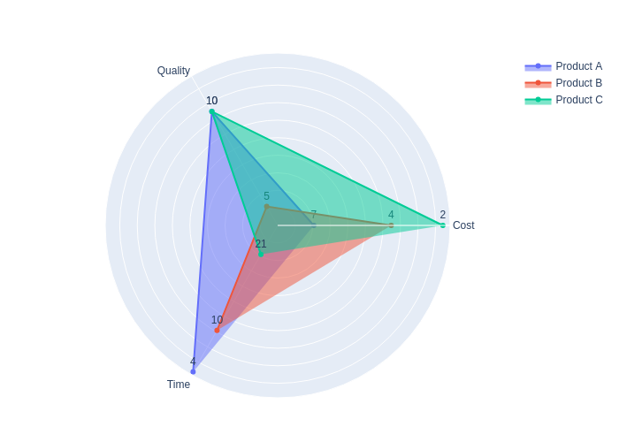
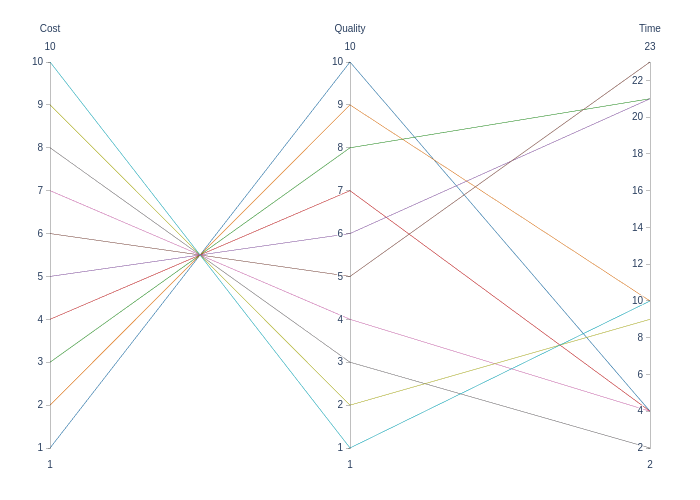
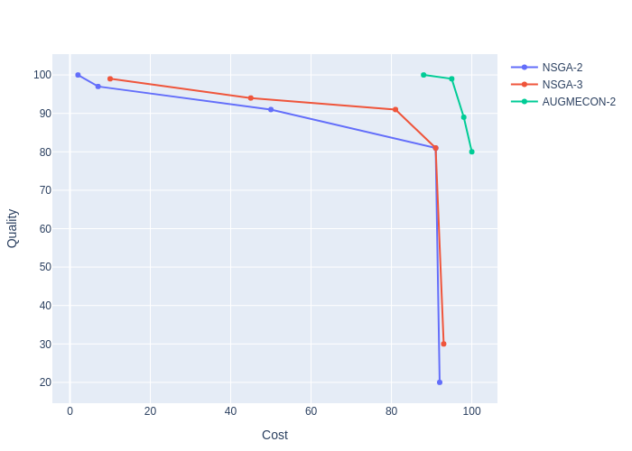
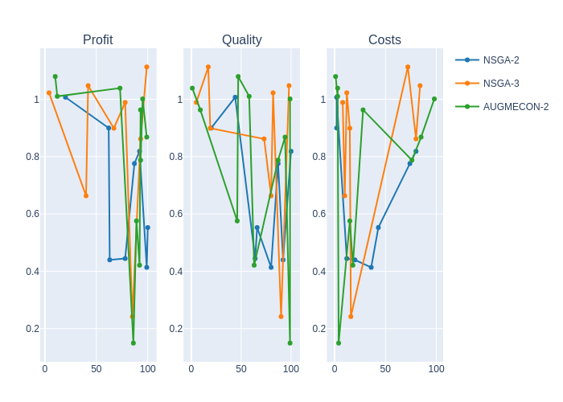

<div align="center">

</div>

# **JuMENTO: Multi-Objective Optimization in Julia**

[](LICENSE)
[](https://julialang.org/)
[](https://github.com/JuliaTesting/Aqua.jl)

JuMENTO is a Julia-based framework for **multi-objective optimization**, implementing two widely used families of methods:

- **AUGMECON** and **AUGMECON 2** (Augmented ε-Constraint Method)
- **NSGA-II** (Non-dominated Sorting Genetic Algorithm II)

It integrates seamlessly with [JuMP](https://jump.dev/) models and provides:

- Exact and metaheuristic optimization methods
- Metrics for Pareto front quality assessment
- Tools for saving and plotting results

---

## **Table of Contents**

- [Installation](#installation)
- [How to Use](#how-to-use)
  - [Build a Model](#build-a-model)
  - [Augmented ε-Constraint Method (AUGMECON)](#augmented-ε-constraint-method-augmecon)
      - [Configure User Options for AUGMECON](#configure-user-options-for-augmecon)
      - [Solve with AUGMECON](#solve-with-augmecon)
  - [NSGA-II](#nsga-ii)
      - [Configure User Options for NSGA-II](#configure-user-options-for-nsga-ii)
      - [Solve with NSGA-II](#solve-with-nsga-ii)
- [Evaluating Frontiers](#evaluating-frontiers)
  - [Plot Results](#plot-results)
  - [Metrics for Evaluation](#metrics-for-evaluation)
- [Example Problems](#example-problems)
- [References](#-references)

---

## **Installation**

For installation, you can download directly from github as follows:

```julia
using Pkg
Pkg.add(url="https://github.com/Josa9321/JuMENTO.jl")
```

---

## **How to Use**

### Build a Model
To solve problems with JuMENTO, you must first define a **JuMP** model (see [JuMP Documentation](https://jump.dev/JuMP.jl/stable/)).
Below is an example showing how to build a model for use with JuMENTO:

```julia
using JuMP, JuMENTO, HiGHS

model = Model(HiGHS.Optimizer)

@variable(model, x[1:2] >= 0) 

@constraints model begin
    c1, x[1] <= 20
    c2, x[2] <= 40
    c3, 5*x[1] + 4*x[2] <= 200
end
@objective(model, Max, [x[1],  3*x[1] + 4*x[2]])
```

Note that the objective sense must be specified when using the `@objective` macro. In JuMENTO, this sense is applied to the entire objective vector. To define the sense of each objective individually, pass the `objective_sense_set`
option when calling `augmecon` (see Section 2.1.).

Alternatively, you may declare the objectives as JuMP variables and assign their values using equality constraints:

```julia
model = Model(HiGHS.Optimizer)

@variables model begin
    x[1:2] >= 0
    objs[1:2]
end

@constraints model begin
    c1, x[1] <= 20
    c2, x[2] <= 40
    c3, 5*x[1] + 4*x[2] <= 200

    objective_1, objs[1] == x[1]
    objective_2, objs[2] == 3*x[1] + 4*x[2]
end
```

As mentioned earlier, the objective sense for each objective can be set individually by passing the `objective_sense_set` option when calling `augmecon`.

---

### Augmented ε-Constraint Method (AUGMECON)

The AUGMECON method is an exact approach that generates the Pareto frontier by solving a series of single-objective optimization problems. It is based on the ε-constraint method, which transforms a multi-objective problem into a single-objective one by treating all but one objective as constraints with specified bounds (ε values). 

For more details on the method, please refer to the original paper by Mavrotas (2009) and its improved version by Mavrotas and Florios (2013).

#### Configure User Options for AUGMECON

When using an AUGMECON-based method, you can control its behavior by passing keyword options to `augmecon`. Some options are required; others are optional. The table below summarizes the available parameters:


| Parameter               | Description                                                           | Default       |
| ----------------------- | --------------------------------------------------------------------- | ------------- |
| `grid_points`         | Number of grid divisions for ε-constraint                            | Required      |
| `nadir`               | Nadir point                                                           | Auto computed |
| `objective_sense_set` | Objective sense for each objective (:Min or :Max)                     | [:Max ...]    |
| `penalty`             | Numeric value that is used by the AUGMECON                            | 1e-3          |
| `bypass`              | Used to know whether or not AUGMECON 2 will be used                   | true          |
| `dominance_eps`       | Tolerance used when determining dominance relations between solutions | 1e-8          |
| `print_level`         | Logging detail (0 or 1)                                               | 0             |


#### Solve with AUGMECON

Solve the model above with the `augmecon` function. The call returns the Pareto frontier (a `Vector{SolutionJuMP}`) and a report with method diagnostics.

```julia
frontier, report = augmecon(model, grid_points=10)
```

If the objectives were declared as JuMP variables in a `objs` vector, call:

```julia
frontier, report = augmecon(model, objs, grid_points=10)
```

---

### NSGA-II

**WARNING: NSGA-II is not properly implemented yet. Use with caution.**

NSGA-II is a popular metaheuristic algorithm for solving multi-objective optimization problems. It is based on the concept of non-dominated sorting and uses a fast elitist approach to maintain a diverse set of solutions. The algorithm iteratively evolves a population of candidate solutions through selection, crossover, and mutation operations, aiming to approximate the Pareto frontier.

#### Configure User Options for NSGA-II

To use AUGMECON, the user can provide some additional information that will be taken into account when making a decision. Below are some of the details:

| Parameter          | Description                                   | Default |
| ------------------ | --------------------------------------------- | ------- |
| `pop_size`         | Population size                               | 100     |
| `generations`      | Number of generations                         | 100     |
| `penalty`          | Penalty type for constraint violations        | linear  |
| `mutation_rate`    | Mutation probability                          | 0.05    |
| `crossover_rate`   | Crossover probability                         | 0.9     |
| `default_range`    | Default variable range if no bounds specified | 100.0   |

*NOTE*: The penalty_type determines how constraint violations are penalized. Each type is recommended for different scenarios:

    - linear: Used where the impact of constraint violations is proportional and moderate and when large violations do not need to be heavily punished.

    - quadratic: Used when you want to strongly discourage large violations while tolearting small ones at the start. He forces solutions to become feasible quickly.

    - inverse: Used when small violations should be penalized more heavily than large ones. He preserves diversity and exploration in early generations.

    - adaptive: Used for difficult problems with many constraints, where you want to allow violations in the early stage and gradually enforce feasibility.

*NOTE*: The default_range value is necessary when no upper bounds are established for a variable. Therefore, a float value is used to determine a possible range. It's also important to note that a very large default_range value can cause the number of generations required to reach a viable solution to take a long time.

#### Solve with NSGA-II

To use NSGA-II, you need to call it with two objects that will store the results. For options, you need to add a ";" after the model. Below is an example:

```julia
frontier, report = nsga2(model; pop_size=200,generations=200,penalty=:quadratic)
```

---

## Evaluating Frontiers

To evaluate the quality of the obtained Pareto frontiers, you can use the plotting and metrics tools provided by JuMENTO. These tools allow you to visualize the trade-offs between objectives and quantitatively assess the performance of different algorithms.

Its important to clarify that the methods implemented here assume the frontier set $F$ is a $m × n$ matrix, where each of the $m$ rows corresponds to an specific objective, and each of the $n$ solutions is represented by a column.

### Plot Results
This module leverages `PlotlyJS.jl` to generate interactive visualizations of Pareto frontiers.

The `JuMENTO.MultiPlots` module provides a suite of plotting functions designed to analyze objective space trade-offs. The implemented visualization types include:
 - Scatter plots (2 to 3 objectives);
 - Parallel coordinate plots;
 - Radar charts (Spider plots);
 - Level diagrams.

The following sections show how to use some of the plotting functions defined in the `JuMENTO.MultiPlots` module.
For a comprehensive technical overview of specific parameters, please refer to the internal documentation for each function.

#### Radar Charts

```julia
using JuMENTO

frontier_set = [
    7 4 2;
    10 5 10;
    4 10 21
]

name_set = ["Product A", "Product B", "Product C"] # Optional, default is "Solution 1", "Solution 2", ...
cats = ["Cost", "Quality", "Time"] # Optional, default is "Objective 1", "Objective 2", ...
sens= [:min, :max, :min] # Optional, default is `:max` for all objectives
eps=0.2 # Optional, default is 0.2. This value is used to expand slightly the normalization range to improve visualization

fig = MultiPlots.radar(frontier_set, sense_set = sens, categories=cats, name_set=name_set, eps=eps)
```

For this frontier, the figure would look like this:



This visualization enables quantitative evaluation of product performance profiles. For instance, Product C occupies a dominant position regarding Quality and Cost; however, it exhibits significantly higher latency (Time), representing a clear trade-off in the objective space.

#### Parallel Coordinate Plots

```julia
using JuMENTO

frontier_set = [
    1 2 3 4 5 6 7 8 9 10.0;
    10 9 8 7 6 5 4 3 2 1;
    4 10 21 4 21 23 4 2 9 10
]

cats = ["Profit", "Quality", "Time"] # Optional, default is f_1, f_2 ...
sens = [:max, :max, :min] # Optional, default is :max for every objective
names = ["Product $j" for j in axes(frontier_set, 2)] # Optional, default is 'Solution 1', 'Solution 2' ...

fig = MultiPlots.parallel_coordinates(frontier_set, categories=cats, sense_set=sens, name_set=names)
```

The resulting figure would look like this:



#### Scatter Plots

```julia
using JuMENTO

v1 = [92.0 50.0 2.0 7.0 91.0; 20.0 91.0 100.0 97.0 81.0]
v2 = [10 45 81 91 93; 99 94 91 81 30]
v3 = [100.0 88.0 98.0 95.0; 80.0 100.0 89.0 99.0]

cats = ["Profit", "Quality"] # Optional, default is "f_1", "f_2"...
names = ["NSGA-2", "NSGA-3", "AUGMECON-2"] # Optional, default is "Method 1", "Method 2"...

fig = MultiPlots.scatter([v1, v2, v3], categories=cats, name_set=names)
```

The resulting figure would look like this:



#### Level Diagrams

```julia
using JuMENTO

cats = ["Profit", "Quality", "Costs"]
names = ["NSGA-2", "NSGA-3", "AUGMECON-2"]

sens = [:max, :max, :min]

v1 = [63.0 62.0 87.0 20.0 100.0 78.0 92.0 99.0; 92.0 20.0 87.0 44.0 66.0 64.0 100.0 80.0; 20.0 2.0 74.0 2.0 43.0 12.0 80.0 36.0]
v2 = [42.0 99.0 78.0 67.0 85.0 4.0 40.0 93.0; 98.0 17.0 5.0 19.0 90.0 82.0 80.0 73.0; 84.0 72.0 8.0 15.0 16.0 12.0 10.0 80.0]
v3 = [92.0 93.0 89.0 86.0 95.0 93.0 10.0 12.0 73.0 99.0; 63.0 9.0 46.0 99.0 99.0 87.0 47.0 58.0 1.0 94.0; 18.0 28.0 15.0 4.0 98.0 76.0 1.0 3.0 3.0 85.0]

fig = MultiPlots.level_diagrams([v1, v2, v3], categories=cats, sense_set=sens, name_set=names)
```

The resulting figure would look like this:



### Metrics for Evaluation

**WARNING: hypervolume metric is still in development, and may be slow to calculate for frontiers with lots of objetives**

To compare the performance of different algorithms, specific multiobjective metrics are used to assess the quality of the solution sets obtained. This assessment typically considers aspects such as the dispersion of solutions and their distance from the Pareto frontier.

The JuMENTO repository includes the implementation of common multi-objective metrics:

- **Spacing (SP)**
  Measures the variation in distances between each solution in the evaluated set and its nearest neighbor in the reference set. Smaller values are desirable.
- **Generalized Distance (GD)**
  Calculates the p-norm of euclidean distances from each solution in the evaluated set to its nearest neighbor in the reference set. Smaller values indicate that the evaluated set is closer to the reference set, which is desirable.
- **Diversity (Δ)**
  Measures the dispersion of the solution set. Smaller values indicate better performance.
- **Hypervolume (HV)**
  Computes the hypervolume of the objective space dominated by the solution set bounded by a reference point. Larger values indicate better performance.
- **Error Ratio (ER)**
  Computes the proportion of solutions in the evaluated set that are not present in the reference set. Smaller values indicate better performance.

The metrics can be applied by calling their respective functions, as shown below:

```julia
using JuMENTO: Metrics

frontier_set = [3 6 9; 15 9 4.0]
reference_set = [1 2 3 4 5 6 7 8 9 10; 10 9 8 7 6 5 4 3 2 1.0]
nadir = [10.1, 15.15]

sp = Metrics.spacing(frontier_set, reference_set)
# 2.0126831744720173

gd = Metrics.general_distance(frontier_set, reference_set)
# 2.0816659994661326

dm = Metrics.diversity(frontier_set, reference_set)
# 0.39696030366206303

er = Metrics.error_ratio(frontier_set, reference_set)
# 1.0

hv = Metrics.hypervolume(frontier_set, nadir)
# 31.165
```

---

## **Example Problems**

To test the implemented multi-objective optimization methods, you can access the "test" folder and check their functionality.

- **Bi-objective**: Simple linear model with two objectives
- **Tri-objective**: Energy planning model with three objectives
- **mokp**: A Multi-objective Knapsack Problem

---

## **References**

### **AUGMECON**

- Mavrotas, G. (2009). "Effective implementation of the epsilon-constraint method in Multi-Objective Mathematical Programming problems." *Applied Mathematics and Computation*, 213(2), 455–465. [DOI: 10.1016/j.amc.2009.03.027](https://doi.org/10.1016/j.amc.2009.03.027)
- Mavrotas, G., & Florios, K. (2013). "An improved version of the augmented ε-constraint method (AUGMECON2) for finding the exact Pareto set in Multi-Objective Integer Programming problems." *Applied Mathematics and Computation*, 219(18), 9652–9669. [DOI: 10.1016/j.amc.2013.03.002](https://doi.org/10.1016/j.amc.2013.03.002)

### **NSGA**

- Deb, K., Pratap, A., Agarwal, S., & Meyarivan, T. (2002). "A fast and elitist multiobjective genetic algorithm: NSGA-II." *IEEE Transactions on Evolutionary Computation*, 6(2), 182–197. [DOI: 10.1109/4235.996017](https://doi.org/10.1109/4235.996017)

### **Additional content**

- Coello Coello, C. A. (2002). "Theoretical and numerical constraint-handling techniques used with evolutionary algorithms: A survey of the state of the art." *Computer Methods in Applied Mechanics and Engineering*, 191(11–12), 1245–1287. [https://doi.org/10.1016/S0045-7825(01)00323-1](https://doi.org/10.1016/S0045-7825(01)00323-1)
- Reynoso-Meza, G., Blasco, X., Sanchis, J., & Herrero, J. M. (2013). Comparison of design concepts in multi-criteria decision-making using level diagrams. Information Sciences, 221, 124–141. [https://doi.org/10.1016/j.ins.2012.09.049](https://doi.org/10.1016/j.ins.2012.09.049)
- Silva, Y. L. T. V., Herthel, A. B., & Subramanian, A. (2019). "A multi-objective evolutionary algorithm for a class of mean-variance portfolio selection problems." *Expert Systems with Applications*, 133, 225–241. [https://doi.org/10.1016/j.eswa.2019.05.018](https://doi.org/10.1016/j.eswa.2019.05.018)
- JuMP Documentation: [https://jump.dev](https://jump.dev)

---
